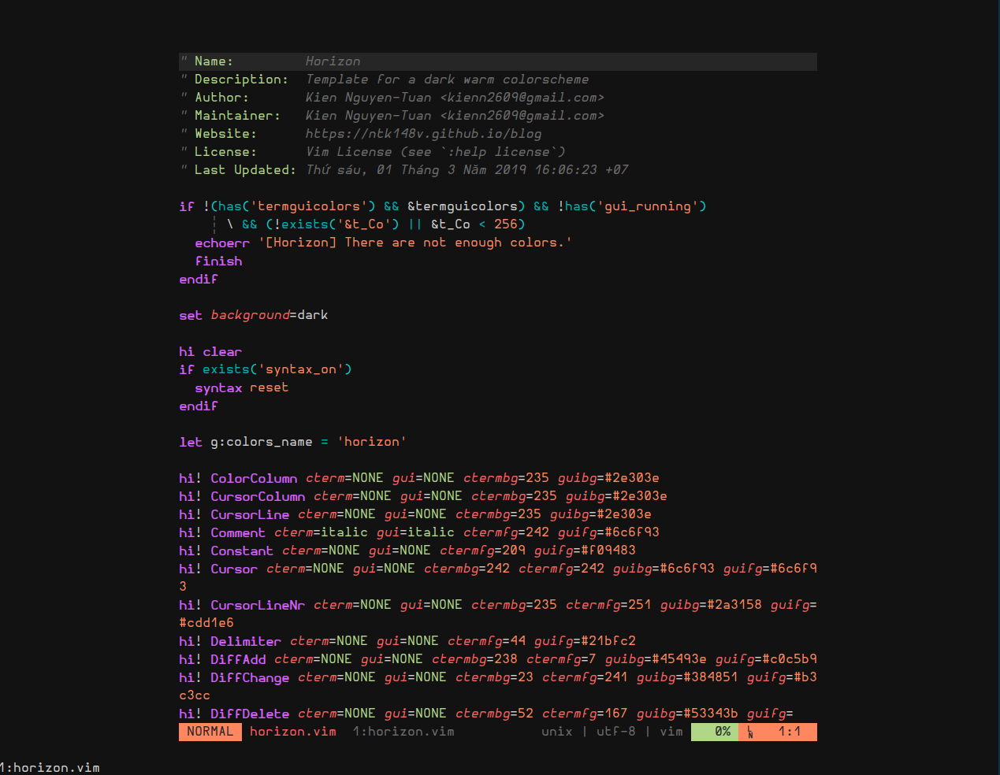
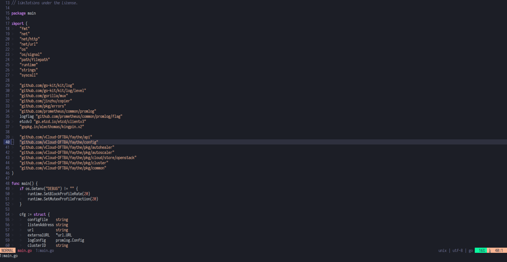
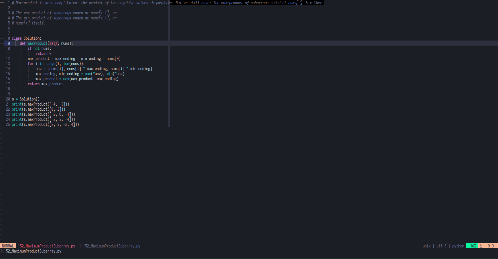

# Horizon

Horizon is a beautifully warm dark colorscheme for Vim & inspired by [Visual Studio Code Horizon Theme](https://marketplace.visualstudio.com/items?itemName=jolaleye.horizon-theme-vscode)

## Installation

- Use [Vim Plug](https://github.com/junegunn/vim-plug)

```vim
Plug 'ntk148v/vim-horizon'
```

- Other Vim Plugin Management Tools should be the same.

## Usage

Put something like this in your vimrc/init.vim:

```vim
" if you don't set this option, this color might not correct
set termguicolors

colorscheme horizon

" lightline
let g:lightline = {}
let g:lightline.colorscheme = 'horizon'

" or this line
let g:lightline = {'colorscheme' : 'horizon'}
```

To apply lightline colorscheme without reloading:

```vim
:let g:lightline.colorscheme = 'horizon'
:call lightline#init()
:call lightline#colorscheme()
```

## Screenshots







## Compatibility

I only tested vim-horizon with Neovim, but it might work with Vim as well.

## Color Palette

| Preview                                                            | Color       | Preview                                                            | Color       | Preview                                                            | Color       |
| ------------------------------------------------------------------ | ----------- | ------------------------------------------------------------------ | ----------- | ------------------------------------------------------------------ | ----------- |
|  | **#09f7a0** |  | **#b877db** |  | **#fab795** |
|  | **#1c1e26** |  | **#d2d4de** |  | **#fab38e** |
|  | **#1c1e26** |  | **#d5d8da** |  | **#95c4ce** |
|  | **#21bfc2** |  | **#e95678** |  | **#f09483** |
|  | **#25b0bc** |  | **#ec6a88** |  | **#6bdfe6** |
